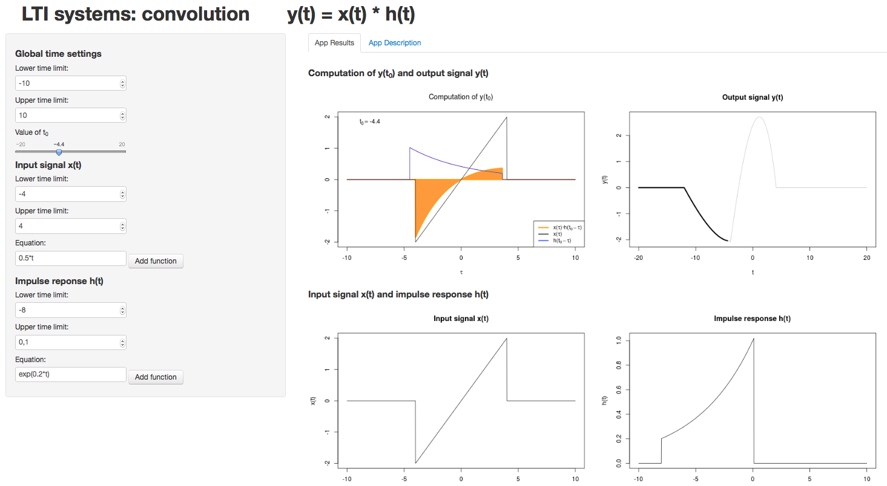
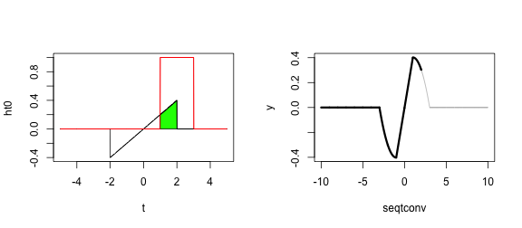

## Convolution in LTI systems

<br>
- Convolution: computes the output $y(t)$ of a LTI system knowing its impulse response $h(t)$.

<div id="over" style="position:absolute; width:100%; height:100%;">
        
</div>
<br><br><br>

- Mathematically, $y(t) = x(t) * h(t) = \int_{-\infty}^{+\infty} x(\tau) h(t-\tau) d\tau$.

<br>

- Having trouble in intepreting the connvolution operation? $\longrightarrow$ <b>Convolution App</b>

<center>https://tranzen.shinyapps.io/convolution/ </center>

--- .class #id 

## App features

<ul>
  <li>Allows to construct arbitray piecwise-functions $x(t)$ and $h(t)$.</li>
  <li>Has a slider to fix an output time instant $t_0$.</li>
  <li>At each value of $t=t_0$, it shows:</li>
        <ul>
                <li>The functions involved in obtaining $y(t_0)$, their product and the computed area.</li>
                <li>The output signal highlighted up to $t_0$</li>
        </ul>
</ul>




--- .class #id 

## Focuses on the computation of $y(t_0)$

- Define two functions $x(t)$ and $h(t)$.


```r
t <- seq(-5,5,1/100); x = t*0; h = t*0; seqt = which(t>=-2 & t<=2)
x[seqt] <- 0.2*t[seqt]; seqt = which(t>=-1 & t<=1); h[seqt] <- 1
```

- Compute the convolution $y(t)$.

```r
library(stats); y <- convolve(x,rev(h),type="open")/100
seqtconv <- seq(2*(-5),2*5,1/100)
```

- For $t_0=2$ (e.g), $y(t_0)=\int_{-\infty}^{+\infty} x(\tau) h(t_0-\tau) d\tau$, i.e. the area under `xht0`.


```r
library(Hmisc); ht0 <- rev(h); t0 <- 2; 
ht0 <- Lag(ht0, 2*100);ht0[is.na(ht0)] <- 0; xht0 <- x*ht0; 
```

--- .class #id 

## Plots and Learning Advantages 


```r
par(mfrow=c(1,2));plot(t,ht0,"l",col="red", ylim=c(min(h,xht0,x),max(h,xht0,x)))  
polygon(t,xht0,col="green"); lines(t,x,"l", col="black"); lines(t,ht0,col="red") 
plot(seqtconv,y,"l",col="grey"); tind <- which(seqtconv<=t0)
lines(seqtconv[tind],y[tind],lwd="3")
```



- Students can play with arbitrary input and impulse response functions.
- They get a feeling on what the product of two functions is.
- They can better understand what the convolution integral does by changning $t_0$.


